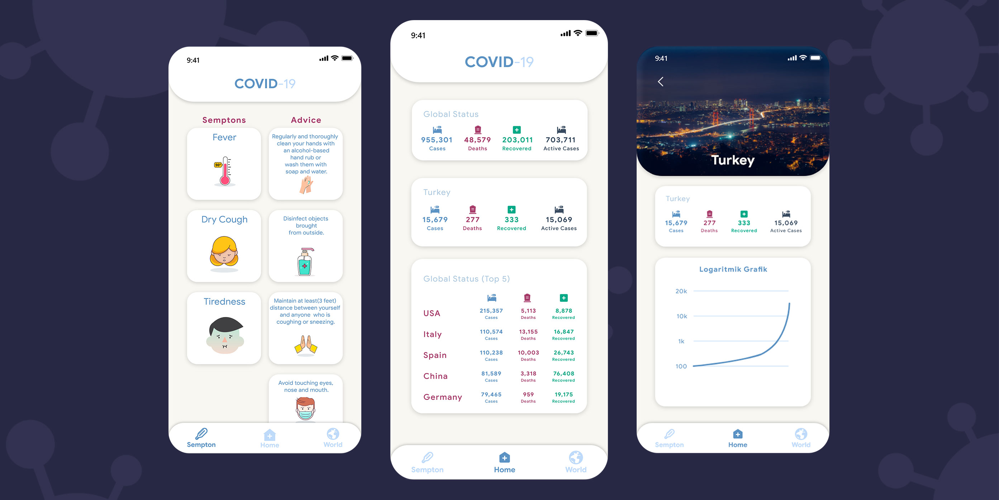

# Covid-19 Tracker
  
 

 
 
 

COVID-19 is the infectious disease caused by the most recently discovered coronavirus. This new virus and disease were unknown before the outbreak began in Wuhan, China, in December 2019. (WHO)

[COVID-19 Details](https://www.who.int/news-room/q-a-detail/q-a-coronaviruses)

This app was made for training. For arrangements and development ideas, please contact me.

# Install

|Android|iOS|Web|Code|
|--|--|--|--|
|[Download APK](https://github.com/mukireus/flutter_covid_19_tracker/releases/download/v1.0/covid19_tracker.v1.0.apk)|Soon|Soon|[Clone the repository](https://github.com/mukireus/flutter_covid_19_tracker/archive/v1.0.zip)|

 If you clone repository, Do not forget the  `flutter pub get` 

# API 
https://github.com/NovelCOVID/API

# UI Design
Made with **Adobe XD**.
[Design Dribbble](https://dribbble.com/shots/10881824-Covid-19-Tracker)

**The data are not up to date in this photos. [Click here](https://www.worldometers.info/coronavirus) for current data.**
# Updates
- [x] v1.0 Project
	- [x] API
		- [x] Global Data
		- [x] Country by Country Data
	- [x] Sempton Screen
	- [x] World Screen
	- [x] Top 5 Country
  - [x] Pull to refresh in main screen
- [x] v1.1.0 Visualisation 
	- [x] Country Details Page
		- [x]  Country Photo
		- [ ] Flag Logo
		- [ ] Linear Graph
		- [ ] Logaritmic Graph
